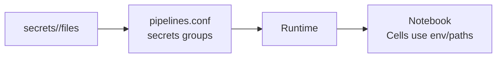

# BitSwan Automations 

## BitSwan Platform

BitSwan is a platform for building automations and microservices directly in Jupyter Notebooks, and deploying them with a single click.

**Key Use Cases:**
- Automation of processes
- Batch / real-time processing of data
- Simple web applications
- REST APIs

## Why Jupyter notebooks
- Step‑by‑step execution: run cells interactively to debug each step
- Clear separation: code, text, and outputs in one place
- Importability: keep complex logic in `scripts/` and import into the notebook
- Extensible forms: embed JS/CSS for better form UX (as in the Discord automation)

## What is a BitSwan automation

A BitSwan automation processes events from a Source, runs them through a sequence of notebook cells (steps), and emits results via a Sink.

**How it works:**

  flowchart LR
    A[Source] --> B[Cells / Steps]
    B --> C[Sink]

- **Source**: where events come from (e.g., WebForm, Webhook, Kafka, Cron/time trigger)
- **Cells**: cells after `auto_pipeline(...)` process each event in order, along with any helper functions defined before the `auto_pipeline(...)` call
- **Sink**: where side‑effects happen (e.g., HTTP call, DB write, file/log)

## Types of automations (triggers)

### Time-triggered automations
Automations that run on a schedule using cron expressions. Ideal for periodic tasks, reporting, cleanup jobs, and scheduled notifications.

**CronSource** (`examples/TimeTrigger`): Triggers pipelines based on cron expressions (e.g., every Monday at 14:20). Built on `CronTrigger` for stable time-based scheduling.

### Manually triggered automations
Automations that wait for user input or HTTP requests. Perfect for web forms, REST APIs, and interactive tools.

**WebFormSource** (`examples/WebForms`): Serves a web form with various field types (text, number, date, checkboxes, repeatable lists). Processes form submissions asynchronously.

**ProtectedWebFormSource** (`examples/ProtectedWebForm`): Web form protected with a secret key. Also functions as a JSON REST endpoint when accessed with the secret parameter. Useful for debugging but not recommended for production.

**JWTWebFormSource** (`examples/JWTWebForm`): Web form where hidden fields are encoded in a JWT token passed as a `secret` query parameter. Provides secure parameter passing.

**WebRouteSource** (`examples/WebServer`): Serves basic HTTP GET/POST endpoints for quick API prototyping. Responds with JSON or other content types.

**ProtectedWebRouteSource** (`examples/ProtectedWebRouteSource`): Protected HTTP route requiring authentication. Returns JSON responses.

**WebHookSource** (`examples/WebHooks`): Listens for incoming HTTP POST requests on a specified port and path. Ideal for integrating with external services that send webhooks.

### Event-triggered automations
Automations that react to messages from streaming platforms, message queues, or real-time data sources. Best for event-driven architectures and data pipelines.

**KafkaSource** (`examples/Kafka2Kafka`): Consumes events from Kafka topics. Processes and optionally forwards to other Kafka topics or systems.

Additional event-triggered sources available in BitSwan (see `bspump` implementation):
- **MQTTSource**: Subscribe to MQTT topics for IoT and messaging scenarios
- **AMQPSource**: Connect to AMQP message brokers (RabbitMQ, etc.)
- **PostgreSQLSource** / **PostgreSQLLogicalReplicationSource**: Trigger on PostgreSQL queries or logical replication
- **MongoDBSource** / **MongoDBChangeStreamSource**: Query or react to MongoDB change streams
- **MySQLSource** / **MySQLBinaryLogSource**: Poll MySQL or process binlog streams

### Pull-based / client HTTP automations
Automations that actively fetch data from remote services.

- **HTTPClientSource**: Periodically GET/POST/stream from HTTP endpoints (<clarify> examples)

### File and storage based automations
Automations that read files, directories, or remote storage.

- **FileLineSource / FileMultiLineSource / FileJSONSource / FileCSVSource / FileBlockSource**: Read local files incrementally
- **FTPSource**: Pull files from FTP servers
- **ElasticSearchSource / ElasticSearchAggsSource**: Query Elasticsearch (<clarify> examples)

### Realtime web automations

- **WebSocketSource**: Consume WebSocket messages (<clarify> examples)

### Internal and utility sources

- **RandomSource / IteratorSource**: Generate or iterate events for testing
- **SubProcessSource**: Wrap subprocess output as events
- **UnitTestSource / TestSource**: Testing utilities

## Project structure (suggested)
```
automation/
  Main.ipynb
  pipelines.conf
  Dockerfile                # optional, recommended for AOC
  secrets/
    <group>/                # secret group(s)
      ...                   # secret files or env-format files
  scripts/                  # helper modules you import from the notebook
  static/                   # optional assets for forms (JS/CSS)
    styles/
    scripts/
```

- `Main.ipynb`: the primary notebook where `auto_pipeline(...)` is called. Cells below it implement the processing steps; helper functions (or imports of helper functions) are typically defined before the `auto_pipeline(...)` call.
- `pipelines.conf`: wiring/configuration for sources, sinks, deployments, and secrets.
- `Dockerfile`: usually very small; the runtime environment is imported and only a few extra packages are installed. It's common not to reference `requirements.txt` here.

## `auto_pipeline` anatomy
The notebook typically has:
1) Imports and helper functions (or imports of helper functions from `scripts/`)
2) `auto_pipeline(...)` call to register Source and Sink
3) Cells after `auto_pipeline(...)` that process each event

```python
# <clarify>: import paths can differ based on your environment
from some_module import auto_pipeline  # <clarify>
from some_module.sources import ProtectedWebFormSource, CronSource  # <clarify>
from some_module.sinks import WebSink, PPrintSink  # <clarify>

# Example: WebForm pipeline
auto_pipeline(
    source=lambda app, pipeline: ProtectedWebFormSource(
        app, pipeline, route="/",
        fields=[
            # ... define fields, e.g. TextField("subject") <clarify>
        ],
        config={"secret": os.getenv("WEBFORM_SECRET", "")}
    ),
    sink=lambda app, pipeline: WebSink(app, pipeline),
    name="FormPipeline"
)

# ... cells below run for each incoming form submission
# event["form"] contains submitted data; set event["content_type"] if returning a body

# Example: Cron pipeline
auto_pipeline(
    source=lambda app, pipeline: CronSource(app, pipeline, config={"when": "20 14 * * 1"}),
    sink=lambda app, pipeline: PPrintSink(app, pipeline),
    name="WeeklyPipeline"
)

# ... cells below run on schedule; read from storage, build a payload, and emit via Sink
```

Note: Locally, create and activate a Python venv and ensure imports resolve. Dependency management is usually defined in your project (e.g., `pyproject.toml`). In AOC, the same imports work inside the runtime environment image.

### Event object (common patterns)
- Dict‑like; typical keys include `event["form"]`, `event["payload"]`, `event["content_type"]`
- Cells can add/modify keys; the Sink consumes them (e.g., `payload`)

Tip: during development, simulate events to enable step‑by‑step execution of cells (e.g., set `event = {...}` or use helpers like `sample_events([...])`).

## Dependencies and build
- Local dev: create a venv and install dependencies so imports work locally and in AOC.
  ```bash
  python -m venv .venv
  . .venv/bin/activate  # Windows: .venv\\Scripts\\activate
  pip install -U pip
  # Manage deps via pyproject.toml (PEP 621) or explicit pip installs
  ```
- Dockerfile: build an image for AOC with your minimal extra deps installed

`Dockerfile` (typical deployed automation)
```dockerfile
from bitswan/pipeline-runtime-environment:2025-17915492359-git-e5c422a
run pip install -U openai
```

### Local quick start (CLI)
```bash
# create and activate venv
python3 -m venv venv
source venv/bin/activate    # Windows: venv\\Scripts\\activate

# install dev deps for local runs
pip3 install -e ".[dev]"

# run an example notebook
bitswan-notebook examples/WebForms/main.ipynb

# optional: watch for changes
bitswan-notebook examples/WebForms/main.ipynb --watch
```
Open http://localhost:8080 in your browser to test examples that expose HTTP endpoints.

## Configuration with `pipelines.conf`
Role: holds environment/config for your automation, wiring sources, sinks, deployments, and secrets.

Examples:

- Deployed automation (typical):
  ```ini
  [deployment]
  pre=internal/<AutomationName>
  expose=true

  [secrets]
  groups=secret1 secret2 secret3
  ```

- Example notebooks (development): structure can vary and use multiple pipelines; see `examples/*/pipelines.conf`.

Secrets in `pipelines.conf` reference secret groups backed by files in your `secrets/` directory, one group per service.

### Secrets (AOC and local)

- In AOC, add a file inside `secrets/<group>` with simple KEY=VALUE lines; the runtime loads these into environment variables:
  ```ini
  PASSNAME=name
  PASSWORD=password
  ```

- Locally, load the same files with `python-dotenv` so your cells see the same environment:
  ```python
  from pathlib import Path
  from dotenv import load_dotenv

  secrets_dir = Path("secrets")
  for name in ["service1", "service2"]:
      p = secrets_dir / name
      if p.exists():
          load_dotenv(p, override=True)
  ```
  See also `examples/automation-server-1-site/demoMeetingBot/demoMeetingDocUpdater/main.ipynb` for a full pattern that locates the appropriate `secrets/` directory and loads multiple groups.

Secrets flow:


### Secrets
- Create a secret group under `secrets/<group>/`
- Reference the group in `pipelines.conf`
- Locally: load via `python-dotenv` or environment variables
- In AOC: secrets are mounted under a shared path and exposed to the runtime <clarify>

## Custom PRE
A PRE is a pre‑built component/image you can reference from your automation (e.g., custom sources/sinks/utilities). Where to register and how to author a PRE depends on your environment. <clarify>

## Tooling
### GitHub Copilot
- Sign‑in steps and screenshots: <clarify>
- Modes: Ask vs Agent; example prompts:
  - “Draft a `CronSource` pipeline that posts to an HTTP endpoint.”
  - “Refactor cell logic into `scripts/helpers.py` and import it.”

### BitSwan VS Code extension
- Location: left sidebar <clarify>
- Automations: view active/inactive; restart, pause, stop; view logs
- “Automation Sources” and “Image Sources” sections may be deprecated in future <clarify>

## Debugging & testing
- Run step‑by‑step in Jupyter (execute cells interactively)
- Run headless via CLI, for example:
  ```bash
  bitswan-notebook examples/WebForms/main.ipynb
  bitswan-notebook examples/WebForms/main.ipynb --watch
  ```
- Deploy, check logs, iterate with Copilot

## Deployment
- Click “Deploy Automation” in the extension
- Verify it’s running in the extension or AOC
- Check logs and metrics to confirm healthy operation

## Automation Server and AOC (overview)

- **Automation Server**: runtime environment where BitSwan automations and microservices are deployed and executed.
  - Runs on a Linux machine with Docker or inside a Kubernetes namespace
  - Can host multiple workspaces, providing isolation between projects and teams
  - Modes:
    - Standalone – fully functional for development and deployment of automations
    - Connected to AOC – integrates with the Automation Operation Center (AOC) for advanced monitoring, process specification, and management features
  - Even when not connected to the AOC, the Automation Server runs 100% autonomously.

- **Workspace / Runspace**: logical separation unit designed to isolate automations, users, and resources.
  - GitOps – manage running automations: deploy, restart, pause, or delete automations; access and monitor logs
  - BitSwan Editor – customized VS Code server with the BitSwan extension: develop and test automations/microservices using the BitSwan Python library and Jupyter; deploy automations with a single click
  - User Management – workspaces are the central building block of user access management

- **Automation Operation Center (AOC)**: centralized visibility and management of BitSwan deployments.
  - Define and specify processes
  - Manage and monitor automations
  - Administer automation servers and workspaces
  - Control user access and roles
  - When connected, Automation Servers and their workspaces continuously send information about deployed automations to the AOC.

Deployment models: Full Cloud, Hybrid, On‑Premise (<clarify> details)
